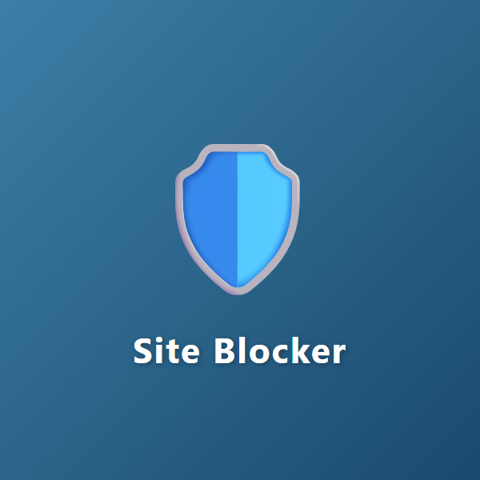
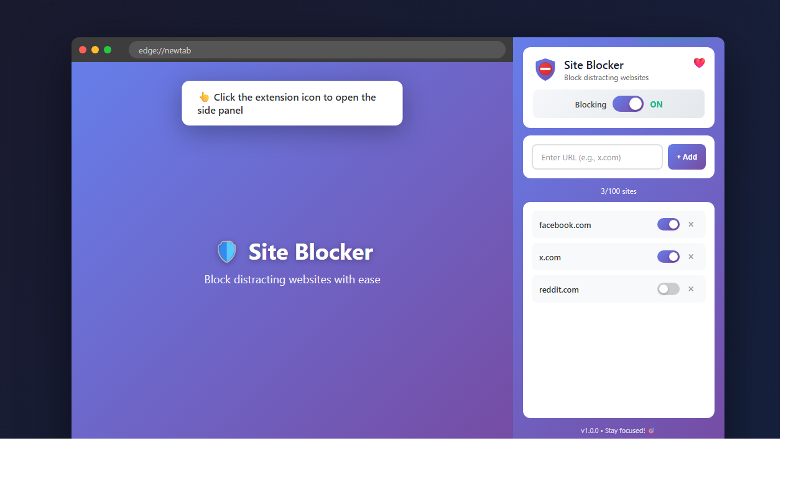
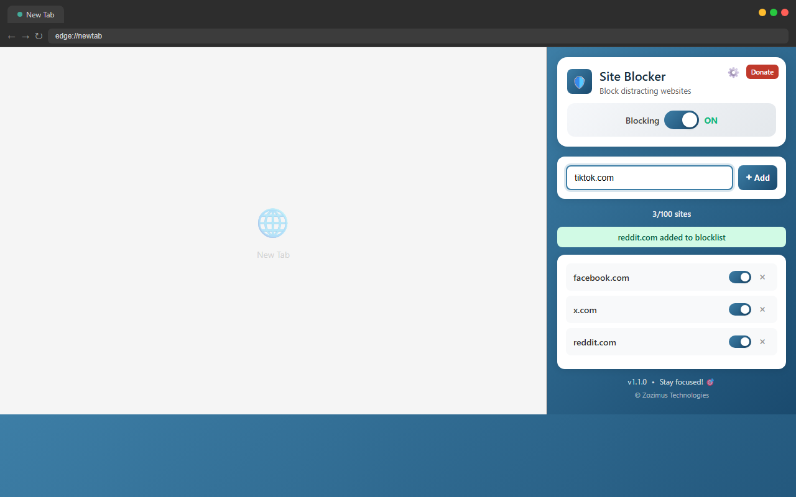
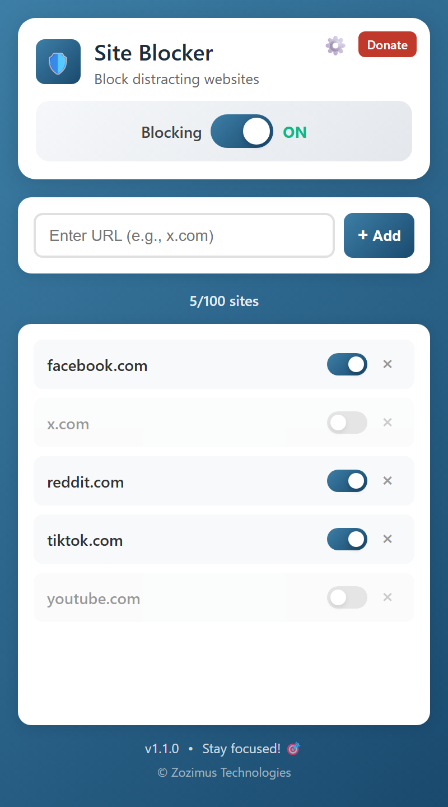
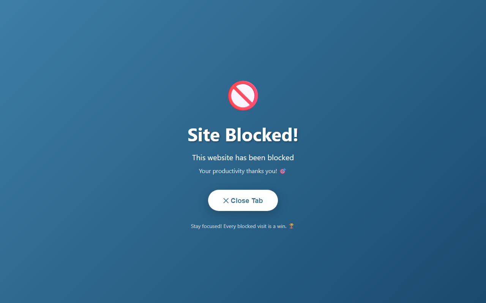
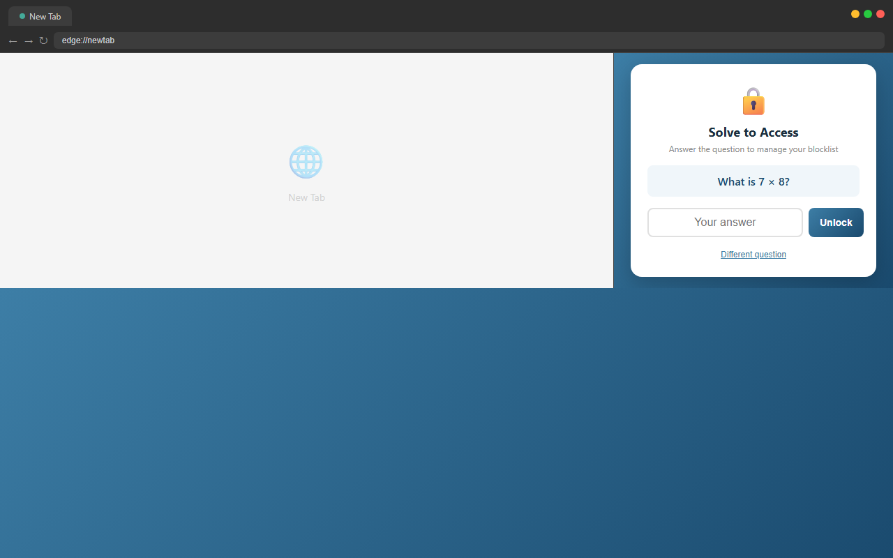
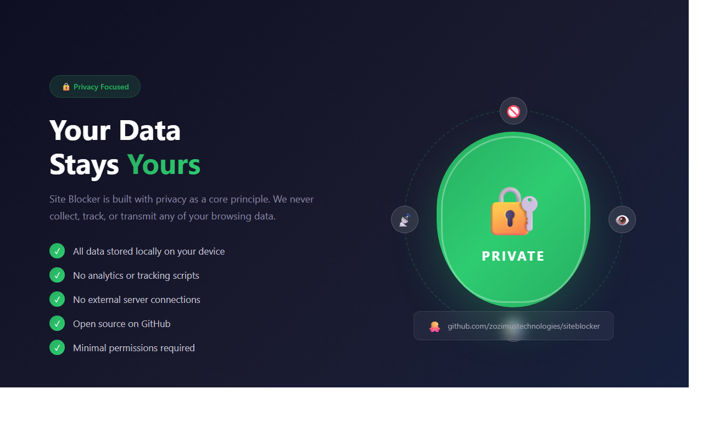

# Site Blocker Extension

<p align="center">
  
</p>

<p align="center">
  <strong>Block distracting websites and boost your productivity</strong>
</p>

<p align="center">
  <a href="#features">Features</a> •
  <a href="#installation">Installation</a> •
  <a href="#usage">Usage</a> •
  <a href="#privacy">Privacy</a> •
  <a href="#support">Support</a>
</p>

<p align="center">
  <a href="https://wise.com/pay/business/sandeepchadda?utm_source=open_link">
    
  </a>
</p>

---

## Features

- 🛡️ **Block Up to 100 Websites** — Add domains to your personal blocklist
- 🔄 **Individual Toggle Controls** — Enable/disable blocking per site without removing it
- ⚡ **Master Switch** — Quickly turn all blocking on/off with one click
- � **Child Safety Math Challenge** — Optional math question gate prevents children from modifying the blocklist
- ⚙️ **Settings Page** — Configure extension behavior via the settings cog
- 🚫 **Clean Blocked Page** — Blocked sites show a clear message with a Close Tab button
- 🎯 **Side Panel UI** — Modern, earthy blue interface accessible from the Edge sidebar
- 🌐 **Subdomain Support** — Blocking `facebook.com` also blocks `m.facebook.com`, `www.facebook.com`, etc.
- 🔒 **Privacy First** — All data stays local, nothing sent to external servers
- 💙 **Free Forever** — No subscriptions, no premium features locked away

## Screenshots

### Side Panel Interface


### Adding Sites to Block


### Toggle Controls


### Blocked Page


### Math Challenge Gate (Child Safety)


### Settings Page


## Installation

### From Edge Add-ons Store (Recommended)
1. Visit the [Site Blocker page on Edge Add-ons](https://microsoftedge.microsoft.com/addons/search?developer=Zozimus%20Technologies)
2. Click **Get** to install
3. Pin the extension to your toolbar for easy access

## Usage

### Adding Sites to Block

1. Click the extension icon in your Edge toolbar
2. If the math challenge is enabled and you already have blocked sites, solve the math question to unlock
3. The side panel opens with the Site Blocker interface
4. Enter a URL (e.g., `facebook.com`, `x.com`, `reddit.com`)
5. Click **+ Add** or press Enter
6. The site is immediately blocked!

### Managing Blocked Sites

| Action | How to |
|--------|--------|
| **Toggle individual sites** | Use the switch next to each domain to temporarily disable/enable blocking |
| **Remove a site** | Click the × button to remove it from your list |
| **Master toggle** | Use the "Blocking ON/OFF" switch at the top to disable all blocking at once (your list is preserved) |
| **Settings** | Click the ⚙️ cog icon in the header to open the settings page |

### Child Safety — Math Challenge

When enabled (default), the extension requires solving a random math question before the blocklist can be viewed or modified. This prevents children from easily disabling their site blocks.

**Question types include:**
- Multiplication (e.g., "What is 7 × 8?")
- Division (e.g., "What is 42 ÷ 6?")
- Solve for x (e.g., "Solve for x: x + 12 = 25")
- Square roots (e.g., "What is the square root of 64?")

The challenge only appears when sites are already blocked (Day N experience). First-time users can add sites without a challenge.

To disable the math challenge, open **Settings** via the ⚙️ cog icon and toggle it off.

### What Happens When You Visit a Blocked Site

When you try to visit a blocked site, you'll see a clean page with:
- 🚫 A clear "Site Blocked!" message
- ✕ A "Close Tab" button to close the blocked tab
- 🎯 Motivational message about staying productive

## Permissions

| Permission | Purpose |
|------------|---------|
| `storage` | Save your blocklist and settings locally in your browser |
| `sidePanel` | Display the side panel UI |
| `declarativeNetRequest` | Block/redirect websites at the network level |
| `<all_urls>` | Apply blocking rules to any website you choose to block |

## How It Works

The extension uses Chrome's `declarativeNetRequest` API (Manifest V3) to efficiently block websites at the network level:

1. **Adding a domain**: When you add a domain like `facebook.com`, a blocking rule is created
2. **Subdomain matching**: The rule automatically matches the domain and ALL its subdomains (m.facebook.com, www.facebook.com, etc.)
3. **Redirect action**: Matched requests are redirected to the `blocked.html` page instead of being silently blocked
4. **Instant sync**: Rules are applied instantly — no browser restart needed

### Technical Details

- **Rule limit**: Up to 5,000 dynamic rules (way more than the 100 site limit)
- **Storage**: Uses `chrome.storage.local` for persisting your blocklist and settings
- **No background polling**: Rules are declarative and handled by the browser itself

## Privacy & Security

🔒 **Your data stays completely local**

| What we DON'T do | What we DO |
|------------------|------------|
| ❌ No external servers | ✅ Everything runs locally |
| ❌ No analytics or tracking | ✅ Open source code |
| ❌ No data collection | ✅ Your blocklist stays in your browser |
| ❌ No account required | ✅ Works offline |

**Open Source**: Inspect the code yourself — all JavaScript is unminified and readable.

## Troubleshooting

### Sites not being blocked
- ✅ Make sure the **master toggle is ON** (shows green "ON" status)
- ✅ Check that the **individual site toggle** is enabled (blue, not gray)
- ✅ Try refreshing the page after adding a site
- ✅ Make sure you entered just the domain (e.g., `facebook.com` not `https://www.facebook.com/page`)

### Extension not loading
- ✅ Ensure **Developer mode** is enabled in `edge://extensions/`
- ✅ Try clicking **Reload** on the extension card
- ✅ Check for errors by clicking "Inspect views: service worker"

### Side panel not opening
- ✅ Click the extension icon in the toolbar (not the puzzle piece menu)
- ✅ If pinned, make sure you're clicking the Site Blocker icon (shield with stop sign)

### Blocked page not showing
- ✅ The blocked page only shows for `main_frame` requests (page navigations)
- ✅ Embedded content (images, scripts) from blocked domains is just blocked silently

### Math challenge not appearing
- ✅ The challenge only shows when at least one site is already blocked
- ✅ Check that the math challenge is enabled in Settings (⚙️)

## Development

### Project Structure

```
siteblocker/
├── manifest.json          # Extension configuration
├── background.js          # Service worker for rule management
├── sidepanel.html         # Side panel UI structure
├── sidepanel.js           # Side panel logic (includes math challenge)
├── sidepanel.css          # Side panel styles
├── options.html           # Settings page structure
├── options.js             # Settings page logic
├── options.css            # Settings page styles
├── blocked.html           # Blocked page
├── blocked.js             # Blocked page script (close tab)
├── icons/
│   ├── icon16.png         # Toolbar icon (16×16)
│   ├── icon48.png         # Extension management icon (48×48)
│   └── icon128.png        # Store listing icon (128×128)
├── store-assets/
│   ├── icon-300x300.png
│   ├── promo-440x280.png
│   ├── promo-1400x560.png
│   ├── screenshot-1-overview.png
│   ├── screenshot-2-add-sites.png
│   ├── screenshot-3-toggles.png
│   ├── screenshot-4-blocked.png
│   ├── screenshot-5-features.png
│   └── screenshot-6-privacy.png
└── README.md
```

### Building for Production

1. Ensure all icons are in PNG format
2. Update version in `manifest.json`
3. Create ZIP file excluding development files:

```bash
# PowerShell
Compress-Archive -Path manifest.json, background.js, sidepanel.html, sidepanel.js, sidepanel.css, options.html, options.js, options.css, blocked.html, blocked.js, icons -DestinationPath site-blocker-extension.zip
```

### API Reference

The extension exposes these message actions via `chrome.runtime.sendMessage`:

| Action | Parameters | Description |
|--------|------------|-------------|
| `getSites` | — | Get all blocked sites and master toggle state |
| `addSite` | `domain` | Add a new site to the blocklist |
| `removeSite` | `domain` | Remove a site from the blocklist |
| `toggleSite` | `domain`, `enabled` | Toggle a specific site's blocking |
| `toggleMaster` | `enabled` | Toggle master blocking on/off |
| `syncRules` | — | Force sync blocking rules with storage |

### Settings Storage Keys

| Key | Type | Default | Description |
|-----|------|---------|-------------|
| `blockedSites` | Array | `[]` | List of blocked site objects |
| `masterEnabled` | Boolean | `true` | Whether blocking is active |
| `mathChallengeEnabled` | Boolean | `true` | Whether the math challenge gate is shown |

## Support Development

If you find this extension useful, consider supporting its development:

<a href="https://wise.com/pay/business/sandeepchadda?utm_source=open_link">
  
</a>

## Version History

### v1.1.0 (Current)
- Earthy blue theme replacing purple/violet gradient
- Child safety math challenge gate (configurable)
- Settings page with cog wheel access from side panel
- Clean blocked page with Close Tab button (dog animation removed)
- Donate button in header
- PNG icons (SVG replaced for Edge store compatibility)
- Security improvements: safe DOM APIs, no innerHTML

### v1.0.0
- Initial release
- Block up to 100 websites
- Individual and master toggle controls
- Side panel UI
- Subdomain blocking support
- Privacy-first design

## License

MIT License — Feel free to modify and distribute.

## Credits

- **Developer**: Zozimus Technologies
- **Icon Design**: Shield with stop sign, earthy blue gradient

---

<p align="center">
  Made with ❤️ for productivity enthusiasts
</p>

<p align="center">
  © Zozimus Technologies
</p>
